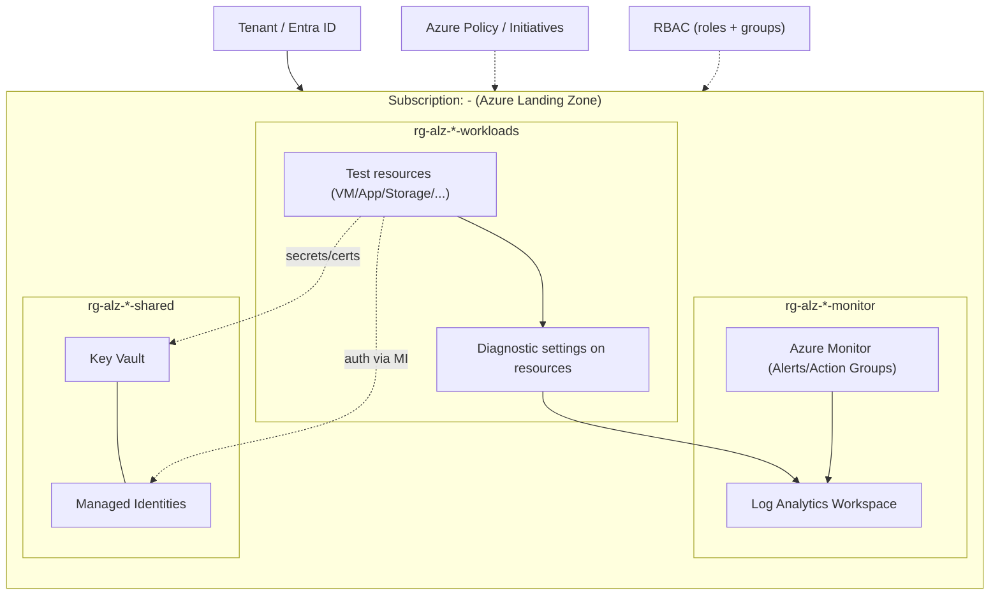

# Azure Landing Zone
**Cel projektu:** zbudowanie lekkiej “landing zone” na jednej subskrypcji Azure, która zapewnia **guardrails (Azure Policy)**, **model uprawnień (RBAC)**, **centralne logowanie (Activity Log → Log Analytics)** oraz **kontrolę kosztów (budżet + alerty)**.

Projekt jest wdrażany w pełni jako **Infrastructure as Code** (Bicep) i zawiera skrypty PowerShell do **deploy/validate/cleanup**.

---

## Spis treści
- [Azure Landing Zone](#azure-landing-zone)
  - [Spis treści](#spis-treści)
  - [Co to jest Landing Zone](#co-to-jest-landing-zone)
  - [Architektura](#architektura)
  - [Co jest wdrażane](#co-jest-wdrażane)
    - [Resource Groups](#resource-groups)
    - [Monitoring](#monitoring)
    - [Governance / Cost](#governance--cost)
    - [RBAC](#rbac)
  - [Standardy: naming i tagi](#standardy-naming-i-tagi)
    - [Obowiązkowe tagi](#obowiązkowe-tagi)
  - [RBAC i grupy (Entra ID)](#rbac-i-grupy-entra-id)
    - [Grupy](#grupy)
    - [Role (scope: subskrypcja)](#role-scope-subskrypcja)
  - [Governance: Azure Policy](#governance-azure-policy)
  - [Monitoring i logowanie](#monitoring-i-logowanie)
    - [Log Analytics](#log-analytics)
    - [Activity Log → Log Analytics](#activity-log--log-analytics)
    - [Przykładowe zapytania KQL](#przykładowe-zapytania-kql)
  - [Kontrola kosztów](#kontrola-kosztów)
  - [Wdrożenie](#wdrożenie)
  - [Walidacja](#walidacja)
    - [Test 1: Brak tagów (Deny)](#test-1-brak-tagów-deny)
    - [Test 2: Zła lokalizacja (Deny)](#test-2-zła-lokalizacja-deny)
    - [Test 3: Poprawne wdrożenie](#test-3-poprawne-wdrożenie)
    - [Test 4: Log Analytics (KQL)](#test-4-log-analytics-kql)
  - [Sprzątanie (cleanup)](#sprzątanie-cleanup)
  - [Dowody (Evidence Pack)](#dowody-evidence-pack)
  - [Struktura repo](#struktura-repo)
  - [Notatki i decyzje](#notatki-i-decyzje)
  - [Roadmap / Kolejne kroki](#roadmap--kolejne-kroki)

---

## Co to jest Landing Zone
**Landing Zone** w Azure to zestaw standardów i bazowych usług platformy, który przygotowuje środowisko pod wdrażanie workloadów w sposób **spójny, bezpieczny i skalowalny**. W tej wersji “Lite” pokazuję fundamenty: **RBAC, Policy, Monitoring, Cost controls**.

---

## Architektura
Diagram: `docs/diagrams/landing-zone.png`


Diagram pokazuje **Azure Landing Zone** w jednej subskrypcji powiązanej z Tenant/Entra ID. W subskrypcji masz trzy Resource Groupy:

- `rg-<project>-<env>-monitor`: centralny Log Analytics Workspace oraz Azure Monitor (alerty i action groups). Monitor “karmi” Log Analytics danymi.\
- `rg-<project>-<env>-shared`: zasoby wspólne — Key Vault i Managed Identities (tożsamości bez haseł); KV jest używany razem z MI.\
- `rg-<project>-<env>-workloads`: testowe zasoby (VM/App/Storage). Każdy zasób ma Diagnostic Settings, które wysyłają logi do Log Analytics.

**Przepływy:**
- Diagnostic settings → Log Analytics (centralne logowanie).\
- Workloads używają MI do dostępu (kropkowana linia “auth via MI”) i pobierają sekrety/certyfikaty z Key Vault.\
- Na całość nałożone są Azure Policy/Initiatives oraz RBAC (kropkowane strzałki) — czyli governance i uprawnienia na poziomie subskrypcji.

**Przepływ logów (high level):**
`Subscription Activity Log` → `Diagnostic Settings` → `Log Analytics Workspace` → `KQL/Alerty` → `Action Group (email)`

---

## Co jest wdrażane

### Resource Groups
- `rg-<project>-<env>-monitor` — monitoring i logi
- `rg-<project>-<env>-shared` — zasoby wspólne (pod przyszłe projekty)
- `rg-<project>-<env>-workloads` — zasoby testowe do walidacji policy

### Monitoring
- Log Analytics Workspace: `law-<project>-<env>` (retencja: `<np. 30 dni>`)
- Diagnostic Settings na subskrypcji: Activity Log → Log Analytics
- Action Group: `ag-<project>-<env>` (email: `<twoj-email>`)

### Governance / Cost
- Azure Policy Assignments (tagi + allowed locations)
- Budget na subskrypcji: `bud-<project>-<env>` (progi: 50/80/100)

### RBAC
- Role assignments na subskrypcji przypięte do grup Entra ID (`sg-alz-*`)

---

## Standardy: naming i tagi
**Project code:** `alz`  
**Environment:** `dev | prod`  
**Region:** `westeurope`

### Obowiązkowe tagi
- `Owner` = `Sebastian`
- `Environment` = `dev | prod`
- `CostCenter` = `LAB | PROD`

---

## RBAC i grupy (Entra ID)

### Grupy
- `sg-alz-ops` — operacje/utrzymanie
- `sg-alz-dev` — tworzenie zasobów (lab)
- `sg-alz-audit` — audyt/odczyt

### Role (scope: subskrypcja)
| Grupa | Rola | Po co |
|------|------|-------|
| `sg-alz-audit` | Reader | Audyt i wgląd bez zmian |
| `sg-alz-ops` | Monitoring Reader + Log Analytics Reader | Obsługa monitoringu i analizy logów |
| `sg-alz-dev` | Contributor | Wdrażanie zasobów w labie (kontrolowane przez policy) |

> W labie `Contributor` dla dev jest akceptowalne. W produkcji zwykle stosuje się węższe role + dodatkowe guardrails.

---

## Governance: Azure Policy

Poniżej przykładowy minimalny zestaw przypisań policy dla Landing Zone Lite (scope: subskrypcja).

| Polityka | Efekt | Parametry | Cel |
|---------|------|----------|-----|
| Allowed locations | Deny | `["westeurope"]` | Blokada wdrożeń poza regionem |
| Require tag on resources | Deny | `Owner` | Wymusza tag Owner na zasobach |
| Require tag on resources | Deny | `CostCenter` | Wymusza tag CostCenter na zasobach |
| Require tag on resource groups | Deny | `Owner`, `Environment`, `CostCenter` | Porządek tagów na RG |

**Uwagi:**
- Na początku można wdrożyć tag policy jako `Audit`, sprawdzić compliance, a potem przełączyć na `Deny`.

---

## Monitoring i logowanie

### Log Analytics
- Workspace: `law-<project>-<env>`
- Retencja: `<np. 30 dni>`

### Activity Log → Log Analytics
- Diagnostic Settings na scope subskrypcji wysyła Activity Log do LA.

### Przykładowe zapytania KQL
> Wklej/zmodyfikuj pod swoje dane (tabela `AzureActivity` jest typowa dla Activity Log w LA).

**Ostatnie zdarzenia administracyjne (24h):**
```kusto
AzureActivity
| where TimeGenerated > ago(24h)
| sort by TimeGenerated desc
| take 50
```

**Nieudane operacje (24h):**
```kusto
AzureActivity
| where TimeGenerated > ago(24h)
| where ActivityStatusValue == "Failed"
| project TimeGenerated, OperationNameValue, ResourceGroup, ResourceId, Caller, ActivityStatusValue, ActivitySubstatusValue
| sort by TimeGenerated desc
```

---

## Kontrola kosztów
- Budget: `<np. 15>`
- Progi alertów: 50% / 80% / 100%
- Odbiorcy powiadomień: `sebqu@outlook.com`

**Zasady “taniego labu”:**
- 1 region + policy Allowed locations
- LA: retencja 30 dni, na start tylko Activity Log
- Po testach uruchamiaj cleanup (żeby nie naliczało kosztów)

---

## Wdrożenie
Szczegółowy opis wdrożenia: `infra/README-deploy.md`

Skrót:
```powershell
pwsh ./scripts/validate.ps1 -Location westeurope -ParamsFile ./infra/params/dev.json
pwsh ./scripts/deploy.ps1   -Location westeurope -ParamsFile ./infra/params/dev.json
```

---

## Walidacja

### Test 1: Brak tagów (Deny)
1. Spróbuj utworzyć zasób bez tagów.
2. Oczekiwany wynik: **Denied by policy**.

### Test 2: Zła lokalizacja (Deny)
1. Spróbuj wdrożyć zasób w innym regionie niż dozwolony.
2. Oczekiwany wynik: **Denied by policy**.

### Test 3: Poprawne wdrożenie
1. Utwórz zasób w `westeurope` z kompletem tagów.
2. Oczekiwany wynik: sukces.

### Test 4: Log Analytics (KQL)
1. Wejdź w Log Analytics → Logs.
2. Uruchom KQL z sekcji Monitoring.
3. Oczekiwany wynik: widoczne zdarzenia.

---

## Sprzątanie (cleanup)
```powershell
pwsh ./scripts/cleanup.ps1 -ProjectName <alz> -Environment <dev>
```

> Cleanup usuwa zasoby wdrożone przez projekt (w tym RG i elementy governance), aby ograniczyć koszty labu.

---

## Dowody (Evidence Pack)
Wszystkie screeny: `docs/screenshots/`

Rekomendowany zestaw:
- `01-rbac-subscription.png` — role assignments na subskrypcji
- `02-loganalytics-overview.png` — Log Analytics workspace
- `03-activitylog-diagnostics.png` — diagnostic settings (Activity Log → LA)
- `04-kql-azureactivity.png` — wynik KQL
- `05-policy-assignments.png` — policy assignments na subskrypcji
- `06-policy-compliance.png` — compliance
- `07-deny-missing-tags.png` — Deny (brak tagów)
- `08-deny-wrong-location.png` — Deny (zły region)
- `09-success-with-tags.png` — sukces + tagi
- `10-action-group.png` — Action Group
- `11-budgets.png` — Budżet + progi

---

## Struktura repo
```
landing-zone/
├─ infra/
│  ├─ main.bicep
│  ├─ evironment/
│  │  ├─ prod.bicepparam
│  │  └─ dev.bicepparam
│  ├─ modules/
│  │  ├─ resourceGroup.bicep
│  │  ├─ logAnalytics.bicep
│  │  ├─ actionGroup.bicep
│  │  ├─ activityLogDiagnostics.bicep
│  │  ├─ budget.bicep
│  │  ├─ policyAssignments.bicep
│  │  └─ rbac.bicep
│  └─ README-deploy.md
├─ scripts/
│  ├─ deploy.ps1
│  ├─ validate.ps1
│  └─ cleanup.ps1
├─ docs/
│  ├─ diagrams/
│  │  ├─ landing-zone-lite.drawio
│  │  └─ landing-zone-lite.png
│  ├─ screenshots/
│  ├─ decisions.md
│  ├─ policies.md
│  ├─ iam.md
│  └─ test-results.md
└─ CONTRIBUTING.md
```

---

## Notatki i decyzje
- Decyzje architektoniczne: `docs/decisions.md`
- Polityki: `docs/policies.md`
- IAM/RBAC: `docs/iam.md`
- Wyniki testów: `docs/test-results.md`

---

## Roadmap / Kolejne kroki
- [ ] Rozbudowa do “Enterprise-scale”: management groups + kilka subskrypcji
- [ ] Network baseline: hub-spoke + private endpoints + DNS
- [ ] Security baseline: Key Vault + Managed Identity + (opcjonalnie) Defender for Cloud
- [ ] CI: pipeline z `what-if` dla PR (GitHub Actions/Azure DevOps)
